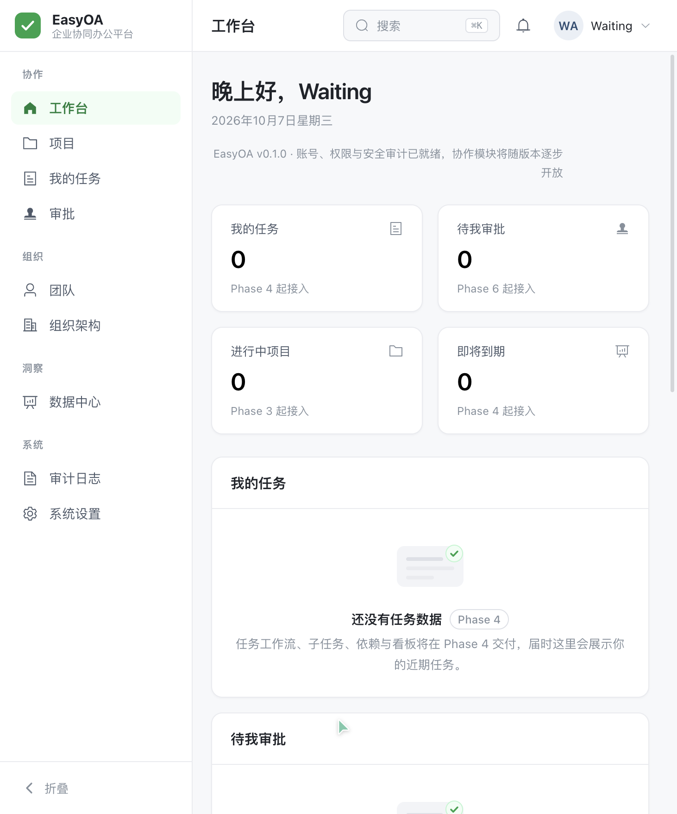
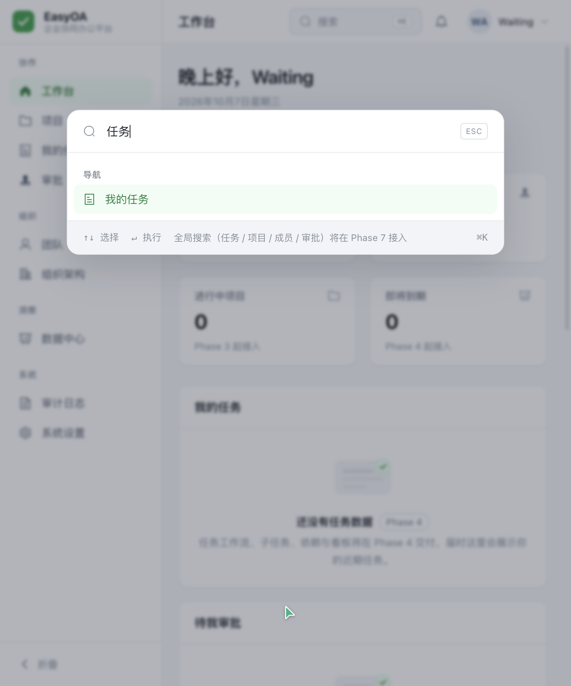
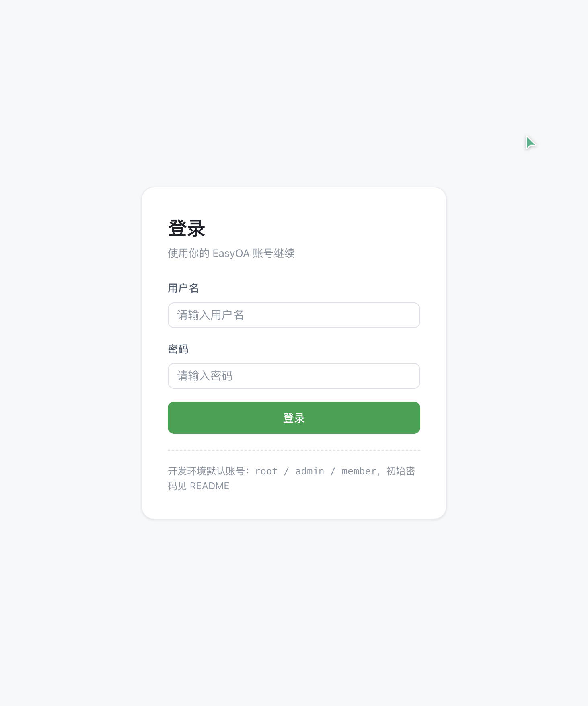

<p align="center">
  
</p>

<h3 align="center">面向学生团队、小公司、工作室的现代化、轻量级、私有化部署协同办公系统</h3>

<p align="center">
  <a href="LICENSE"></a>
  
  
  
  
  
</p>

---

## 产品介绍

EasyOA 属于 Easy 系列产品，定位不是传统臃肿 OA，而是一套**可真实部署、可长期维护**的私有化协同办公系统。

核心主线：

```
项目协作 → 任务执行 → 团队沟通 → 审批流转 → 组织管理 → 安全审计
```

EasyOA 优先保证：

| 优先级 | 关注点 | 落地方式 |
| ------ | ------ | -------- |
| 1 | 项目协作体验 | 项目 / 任务 / 看板 / 侧栏详情，而不是表格堆砌 |
| 2 | 数据安全 | 后端强制鉴权、附件鉴权下载、Session 化认证 |
| 3 | 权限边界 | 系统角色 / 项目角色 / 任务角色 / 资源归属统一计算 |
| 4 | 操作可追溯 | 审计日志与安全事件 Append Only，永不删除 |
| 5 | UI/UX 质量 | Easy 系列设计令牌 + 自有组件层，摆脱后台模板感 |
| 6 | 私有化部署体验 | `docker compose up -d` 即可自建，数据留在自己服务器 |
| 7 | 后期可维护性 | 模块化单体（Modular Monolith）+ 迁移脚本 + CI |

**重要原则：前端永远不可信。** 隐藏按钮、路由拦截、UI 条件显示都不构成权限控制；
即使用 `curl` / Postman 直接调用 API，也不得访问任何未授权数据。

---

## Screenshots

| 工作台 | 命令面板（⌘K / Ctrl+K） |
| ------ | ----------------------- |
|  |  |

| 登录页 | 模块占位页（明确标注交付阶段） |
| ------ | ----------------------------- |
|  | 未交付模块统一以空状态呈现，不使用假数据 |

> 以上截图取自本地真实运行界面（Phase 1 交付版本，数据为真实数据：账号、会话与审计均已生效）。

---

## Features

### v0.1.0 已交付（Phase 0 ~ Phase 1）

- **账号与认证**：Session Cookie（HttpOnly + Secure + SameSite）认证，BCrypt 哈希，密码强度策略
- **安全防护**：CSRF 双提交校验（防 BREACH 的 XOR 编码）、登录失败限制与临时锁定、Session Fixation 防护
- **会话治理**：会话记录使用 HMAC 签名存储（数据库不存原始 Session ID）、登录设备列表与撤销、改密即踢出其他设备
- **首次初始化**：`/setup` 一次性创建组织与 ROOT，完成后永久关闭（数据库原子开关保证不可重放）
- **审计基础设施**：审计日志与安全事件 Append Only（仓储层不暴露 update/delete），哈希链预留
- **工程基建**：统一 API 响应、统一异常处理、RequestId 全链路、结构化访问日志、Flyway 迁移、OpenAPI 文档
- **设计系统**：Easy 系列 Design Tokens（90% 中性色 + 10% Easy Green）、EasyUI 组件层、Element Plus 主题映射
- **界面框架**：Sidebar / Topbar / 工作台 / 登录 / 初始化 / 命令面板 / 403 / 404
- **部署与 CI**：Docker Compose（Nginx + Web + API + PostgreSQL）、GitHub Actions（后端测试打包 / 前端类型检查构建 / Compose 校验 / Tag 发布）

### Roadmap 中的能力（按阶段交付）

项目协作（Phase 3）· 任务工作流与依赖（Phase 4）· 评论与文件（Phase 5）· 审批流转（Phase 6）·
通知中心与全局搜索（Phase 7）· TOTP 与高危操作通道（Phase 8）· 数据洞察（Phase 9）

> 未交付的模块在界面中以**明确标注交付阶段**的空状态呈现，不会用假数据或假页面充数。

---

## Architecture

```
Internet
   │
   ▼
[ 80 / 443 ]  Nginx（TLS 终止、安全响应头、真实 IP 覆写）
   │
   ├─────────────► easyoa-web   （Vue 3 静态资源 + SPA 回退）
   │
   └─────────────► easyoa-api   （Spring Boot 单体应用）
                        │
                        ▼
                   postgres（仅容器内部网络可达，不暴露公网）
```

后端采用 **模块化单体（Modular Monolith）**，业务模块内部按 `controller / application / domain /
repository / dto` 分层；`v0.1.0` 不引入微服务、消息队列、Redis 与 Elasticsearch
（无真实需求时不提前引入复杂度）。

| 模块 | 职责 |
| ---- | ---- |
| `common` | 统一响应、异常、RequestId、结构化日志、安全配置、工具 |
| `auth` | 登录、登出、会话、登录失败限制、密码策略 |
| `user` | 用户主数据与档案 |
| `system` | 系统设置、首次初始化 |
| `audit` | 审计日志（Append Only，查询仅 ADMIN / ROOT） |
| `securityevent` | 安全事件与哈希链 |
| `workspace` | 工作台聚合 |
| `organization` / `project` / `task` / `approval` / `notification` / `file` | 目录骨架已就位，按 Phase 2~6 交付 |

---

## Tech Stack

| 层 | 技术 |
| -- | ---- |
| 后端 | Java 21 · Spring Boot 3.5 · Spring Security · Spring Data JPA · Hibernate Validator · Flyway · springdoc-openapi |
| 数据库 | PostgreSQL 16（`TIMESTAMPTZ` / `jsonb` / `WITH RECURSIVE`） |
| 前端 | Vue 3.5 · TypeScript（strict）· Vite · Vue Router · Pinia · Axios · Element Plus（仅作底层组件库） |
| 基础设施 | Docker · Docker Compose · Nginx |
| 测试 | JUnit 5 · AssertJ · MockMvc · Testcontainers（真实 PostgreSQL） |

---

## Quick Start

### 一键部署（推荐）

```bash
# 1. 准备环境变量
cp .env.example .env
#    必须修改：POSTGRES_PASSWORD、EASYOA_SESSION_SECRET（>= 32 位随机串）
#    生成随机密钥：openssl rand -base64 48

# 2. 准备 TLS 证书（本地/内网试用可自签名；生产请使用受信任证书）
./scripts/generate-self-signed-cert.sh your-domain.com

# 3. 启动
docker compose up -d --build

# 4. 查看状态
docker compose ps
```

首次访问 `https://your-domain`（自签名证书需在浏览器中信任）：

1. 进入 `/setup` 初始化：设置组织名称、ROOT 用户名与密码；
2. 初始化完成后 `/setup` 永久关闭；
3. 使用 ROOT 账号登录，即可进入工作台。

### 本地开发

见 [docs/local-development.md](docs/local-development.md)。最短路径：

```bash
cp .env.example .env
docker compose -f docker-compose.dev.yml up -d      # 仅启动 PostgreSQL（绑定 127.0.0.1）

cd backend && ./mvnw spring-boot:run                # http://localhost:8080
cd frontend && npm install && npm run dev           # http://localhost:5173
```

开发环境（`dev` profile）会自动注入演示账号：`root`（ROOT）/ `admin`（ADMIN）/ `member`（MEMBER），
初始密码均为 `EasyOA@2026`；**生产环境绝不会创建任何演示数据**。
如需验证首次初始化（`/setup`）流程，用 `EASYOA_DEV_SEED=false` 启动后端即可跳过种子数据。

---

## Docker Deployment

生产编排包含四个服务与两个隔离网络角色：

| 服务 | 说明 |
| ---- | ---- |
| `nginx` | 边缘入口：80 → 443 跳转、TLS、安全响应头、`/api` 与静态资源分流 |
| `easyoa-web` | 前端静态资源容器（Nginx，仅内部网络可达） |
| `easyoa-api` | 后端 API（JRE 21，非 root 用户运行，`/actuator/health` 健康检查） |
| `postgres` | 数据库（**不映射宿主机端口**，仅容器内部网络可访问） |

安全细节：

- 数据库端口仅 Docker 内部网络可达；
- 只有 `nginx` 暴露 `80` / `443`，`22` 保持系统 SSH；
- `X-Forwarded-For` 由 Nginx **覆写**而非追加，客户端无法伪造来源 IP；
- `/actuator/*` 仅放行 `/actuator/health`，其余返回 404。

完整部署说明与升级步骤见 [docs/deployment.md](docs/deployment.md)。

---

## Configuration

全部通过环境变量注入（`.env`，不入库、不提交 Git）：

| 变量 | 必填 | 说明 |
| ---- | ---- | ---- |
| `POSTGRES_DB` / `POSTGRES_USER` / `POSTGRES_PASSWORD` | ✅ | 数据库连接与凭据 |
| `EASYOA_SESSION_SECRET` | ✅ | 会话签名与未来敏感字段加密主密钥，长度 ≥ 32 |
| `EASYOA_BASE_URL` | ➖ | 对外访问地址（文档与链接生成） |
| `EASYOA_PROFILE` | ➖ | `prod`（默认） / `dev` |
| `EASYOA_SESSION_TIMEOUT_MINUTES` | ➖ | 会话有效期，默认 480 分钟 |
| `EASYOA_LOGIN_MAX_FAILURES` / `EASYOA_LOGIN_LOCK_MINUTES` | ➖ | 登录失败限制，默认 5 次 / 15 分钟 |
| `EASYOA_STORAGE_PATH` | ➖ | 附件存储目录（Phase 5 使用） |
| `EASYOA_HTTP_PORT` / `EASYOA_HTTPS_PORT` | ➖ | 边缘 Nginx 端口，默认 80 / 443 |
| `EASYOA_TLS_CERT_DIR` | ➖ | 证书目录，默认 `./infra/nginx/certs` |

应用内配置（`easyoa.*`）与 Spring 配置位于 `backend/src/main/resources/application*.yml`。

---

## Security Model

> 设计冲突时的优先级：**Security > Data Integrity > Business Correctness > UX > Convenience**

### 认证与会话

- 使用 **Session Authentication**，不使用 JWT，不把 Token 放进 `localStorage`；
- Cookie 属性：`HttpOnly` + `Secure`（生产）+ `SameSite=Lax`；
- 登录成功后执行 Session Fixation 防护（更换 Session ID）；
- 会话记录表只保存 `HMAC-SHA256(主密钥, sessionId)`，数据库泄露也无法伪造会话；
- 会话被撤销（登出 / 改密 / 手动下线）后，旧 Cookie 立即失效（过滤器实时校验）。

### 授权

- 所有资源访问都必须由后端重新执行：认证 → 授权 → 数据范围 → 资源归属校验；
- 统一使用 DTO 接收输入，禁止 Controller 直接接收实体（防 Mass Assignment）；
- 错误响应统一结构，401 / 403 / 404 / 409 / 422 / 429 语义明确，且不泄露内部细节。

### 审计与安全事件

- `audit_logs` 与 `security_events` 为 **Append Only**：应用服务只提供 create/query，
  仓储接口在类型层面就没有 delete/update 能力；
- 任何用户（含 ROOT、ADMIN）都不得删除审计记录；
- 记录字段包含 actor、action、resource、before/after、reason、IP、UA、requestId、riskLevel；
- 安全事件额外保留 `previous_hash` / `entry_hash` 哈希链字段。

### 前端不可信

前端的路由守卫、菜单隐藏、指令控制**只影响体验**。
所有权限判断在后端独立执行——绕过 Web 界面直接调用 API 同样会被拒绝。

---

## Project Structure

```
EasyOA/
├── backend/                       # Spring Boot 应用
│   ├── src/main/java/com/easyoa/
│   │   ├── common/                # 响应 / 异常 / RequestId / 日志 / 安全 / 工具
│   │   ├── auth/                  # 认证与会话
│   │   ├── user/  system/         # 用户主数据 / 系统设置与初始化
│   │   ├── audit/ securityevent/  # 审计与安全事件（Append Only）
│   │   ├── workspace/             # 工作台聚合
│   │   └── organization/ project/ task/ approval/ notification/ file/   # 分阶段交付
│   ├── src/main/resources/db/migration/   # Flyway 迁移脚本
│   └── src/test/java/             # 单元测试 + Testcontainers 集成测试
├── frontend/                      # Vue 3 + TypeScript 应用
│   └── src/
│       ├── api/                   # Axios 客户端与类型化接口
│       ├── components/easy/       # EasyUI 设计系统组件
│       ├── layouts/               # Sidebar / Topbar / 主框架
│       ├── router/  stores/       # 路由（含守卫）与 Pinia 状态
│       ├── styles/                # Design Tokens / 基础样式 / Element 主题映射
│       └── views/                 # 登录 / 初始化 / 工作台 / 占位页 / 403 / 404
├── infra/nginx/                   # 边缘 Nginx 配置与证书目录
├── scripts/                       # 运维脚本（自签名证书等）
├── docs/                          # 部署与开发文档、截图、Logo
├── docker-compose.yml             # 生产编排
└── docker-compose.dev.yml         # 本地开发（仅 PostgreSQL）
```

---

## Roadmap

| 阶段 | 内容 | 状态 |
| ---- | ---- | ---- |
| Phase 0 | 仓库基建：README / CI / Docker Compose / Nginx / 环境样例 | ✅ 已完成 |
| Phase 1 | 核心基建：User / Auth / Session / Security / Error / Audit / 初始化 | ✅ 已完成 |
| Phase 2 | 组织架构：组织树、多组织归属、主部门、团队页面 | ⏳ 下一步 |
| Phase 3 | 项目：生命周期、OWNER / DEPUTY / MEMBER、项目权限与概览 | ⏳ |
| Phase 4 | 任务：工作流、子任务、依赖与循环检测、看板、任务侧栏（**v0.1.0 重点**） | ⏳ |
| Phase 5 | 评论与文件：回复 / @ / 编辑历史 / 撤回 / 受控下载 | ⏳ |
| Phase 6 | 审批：模板版本、表单快照、ANY_ONE / ALL、动态与替补审批人 | ⏳ |
| Phase 7 | 工作台：通知中心、全局搜索、命令面板检索、Activity Feed | ⏳ |
| Phase 8 | 安全：TOTP、ROOT 高危操作通道、审计视图、安全设置 | ⏳ |
| Phase 9 | 洞察：项目健康度、任务趋势、逾期与负载、审批效率 | ⏳ |

---

## Contributing

1. 提交信息遵循 [Conventional Commits](https://www.conventionalcommits.org/)：
   `feat(task): add dependency cycle detection` / `fix(auth): prevent unauthorized file access`
2. 每个模块必须同时覆盖：数据模型、API、权限、审计、前端、错误状态、测试；
3. 不允许只实现「Happy Path」，不允许用 TODO 假装实现核心逻辑，不允许把权限放到前端；
4. 提交前本地必须通过：

```bash
cd backend  && ./mvnw test && ./mvnw package
cd frontend && npm run type-check && npm run build
cp .env.example .env && docker compose -f docker-compose.yml config -q
```

5. 数据库结构变更必须通过 Flyway 迁移脚本；生产环境禁止 `ddl-auto=create/update`。

---

## License

[MIT](LICENSE) © 2026 EasyOA — Easy Series