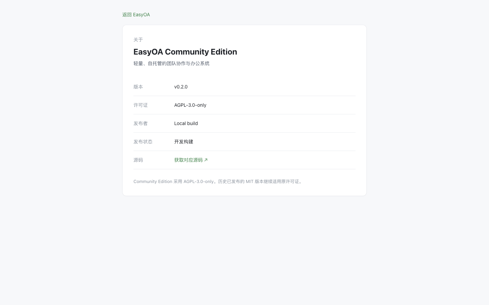

<p align="center">
  
</p>

<h1 align="center">EasyOA</h1>

<p align="center">EasyOA 是一款面向团队协作与项目管理的轻量级私有化协同办公系统。</p>

<p align="center">
  <a href="VERSION"></a>
  <a href="LICENSE"></a>
  
  
  
  
  <a href="https://github.com/YEXIAONAN/EasyOA/actions/workflows/ci.yml"></a>
</p>

## 项目简介

围绕项目、任务、审批和组织，把日常协作放在同一个工作空间。适合学生团队、工作室、实验室和小型工程团队，在自己的服务器上管理协作数据。

- **围绕工作展开**：从工作台查看待办，在项目看板推进任务，打开侧栏处理详情。
- **责任与范围清楚**：系统、项目和任务角色各有边界，访问权限由后端校验。
- **自托管与可追溯**：Docker 部署、受控附件访问、会话管理和操作审计。

## Screenshots


开发构建截图（v0.1.x；关于页 v0.2.0）。

<details>
<summary>📸 查看更多 EasyOA 界面</summary>

| 项目列表 | 项目概览 |
| --- | --- |
|  |  |

| 任务看板 | 任务详情侧栏 |
| --- | --- |
|  |  |

| 我的任务 | 依赖覆盖确认 |
| --- | --- |
|  |  |

| 评论与回复 | 任务附件 |
| --- | --- |
|  |  |

| 团队成员 | 组织架构 |
| --- | --- |
|  |  |

| 成员档案 | 从档案打开任务 |
| --- | --- |
|  |  |

| 审批列表 | 审批详情 |
| --- | --- |
|  |  |

| 命令面板 | 全局搜索 |
| --- | --- |
|  |  |

| 登录页 | 登录页窄屏展示 |
| --- | --- |
|  |  |

| 工作台窄屏展示 | 关于 EasyOA |
| --- | --- |
|  |  |

| 安全中心 | 动态口令绑定 |
| --- | --- |
|  |  |

| 审计日志 | 安全事件 |
| --- | --- |
|  |  |

| 安全设置 | 高危操作确认 |
| --- | --- |
|  |  |

| 数据中心 | 逾期任务与成员负载 |
| --- | --- |
|  |  |

</details>

## Features

| 能力 | 可以做什么 |
| --- | --- |
| 项目协作 | 管理项目状态、成员与负责人，在概览、看板、任务、成员和设置之间切换；归档后保留只读记录。 |
| 任务与看板 | 自定义任务状态，安排主副负责人、协作者、一级子任务和同项目依赖；支持拖拽与跨项目「我的任务」。 |
| 组织与成员 | 维护部门和团队树、成员多组织归属与主部门，按可见范围查看成员档案及协作记录。 |
| 审批流程 | 使用版本化模板和自定义表单，配置动态审批人、会签 / 或签，保留退回、重新提交与审批历史。 |
| 评论与附件 | 在任务中回复、@成员、查看编辑历史和撤回记录；任务及审批附件经权限校验后下载。 |
| 通知与搜索 | 接收任务、评论、审批和项目通知；用 ⌘K / Ctrl+K 搜索并直达有权访问的内容。 |
| 安全与审计 | Session 认证、TOTP、登录设备管理、后端授权和操作留痕；ROOT 高危操作需再次验证与确认。 |
| 数据洞察 | 查看项目健康度、任务趋势、逾期任务、成员负载与审批效率，统计范围随权限收敛。 |
| 私有化部署 | 通过 Docker 在自己的服务器运行，使用命令入口管理服务、备份和恢复。v0.2.0 签名发行流程仍在验收。 |

权限、会话、审计和发行校验的边界见[安全说明](docs/SECURITY.md)。当前主要面向桌面 Web；窄屏截图用于展示已有适配，不代表独立移动端产品。

## Quick Start

### 部署签名发行包

需要 Docker、Docker Compose v2、Bash、curl、支持 Ed25519 的 OpenSSL 和 Python 3.11+。先按[部署指南](docs/deployment.md)取得并验证发行包，配置 `.env` 中的访问域名和 TLS 证书，然后在包目录执行：

```bash
./easyoactl install
./easyoactl start
```

访问启动器显示的 HTTPS 地址，首次进入 `/setup` 设置组织名称与 ROOT 账号，初始化完成后登录工作台。本机试用可使用 `install --self-signed-tls`；Windows 使用 `.\easyoactl.ps1`，详细步骤见部署指南。

**v0.2.0 当前为待发布版本，签名包尚未正式发布。** 当前源码可按下方方式运行；旧版 v0.1.1 的安装方式以对应 Tag 文档为准。

### 运行当前源码

准备 JDK 21、Node.js 22.12+、Docker 和 Compose v2：

```bash
git clone https://github.com/YEXIAONAN/EasyOA.git
cd EasyOA
./easyoactl dev
```

打开 <http://127.0.0.1:5173>。开发配置、演示账号和分别启动前后端的方式见[二次开发指南](docs/DEVELOPMENT.md)。

## Tech Stack

| 层 | 技术 |
| --- | --- |
| 后端 | Java 21 · Spring Boot 3.5 · Spring Security · Spring Data JPA |
| 前端 | Vue 3.5 · TypeScript · Vite · Element Plus · EasyUI |
| 数据库 | PostgreSQL 16 · Flyway |
| 基础设施与测试 | Docker · Nginx · GitHub Actions · JUnit 5 · Testcontainers |

## Documentation

| 文档 | 内容 |
| --- | --- |
| [🚀 部署指南](docs/deployment.md) | 安装、TLS、环境变量、备份、恢复、升级与故障排查 |
| [🛠 二次开发](docs/DEVELOPMENT.md) | 本地环境、架构、模块边界、EasyUI、测试与开发检查 |
| [🐛 Bug 提交指南](docs/BUG_REPORTING.md) | 环境信息、复现步骤、日志脱敏与可复制模板 |
| [🔐 安全说明](docs/SECURITY.md) | 安全机制、已知边界、支持范围与私密漏洞报告 |
| [🤝 贡献指南](docs/CONTRIBUTING.md) | Fork、分支、Commit、PR 与代码审查 |

AI 辅助开发另需遵守 [AGENTS.md](AGENTS.md) 入口与 [EasyOAAgent.md](EasyOAAgent.md) 开发宪法。

## License

EasyOA Community Edition 自 v0.2.0 起采用 [AGPL-3.0-only](LICENSE)。历史发布版本继续适用 MIT，详见 [NOTICE](NOTICE)。

## Community / Feedback

发现问题请先阅读 [Bug 提交指南](docs/BUG_REPORTING.md)，再提交可复现的 [GitHub Issue](https://github.com/YEXIAONAN/EasyOA/issues)。安全漏洞请按[安全说明](docs/SECURITY.md)私密报告，勿提交公开 Issue。

欢迎贡献修复与改进，流程见[贡献指南](docs/CONTRIBUTING.md)。
